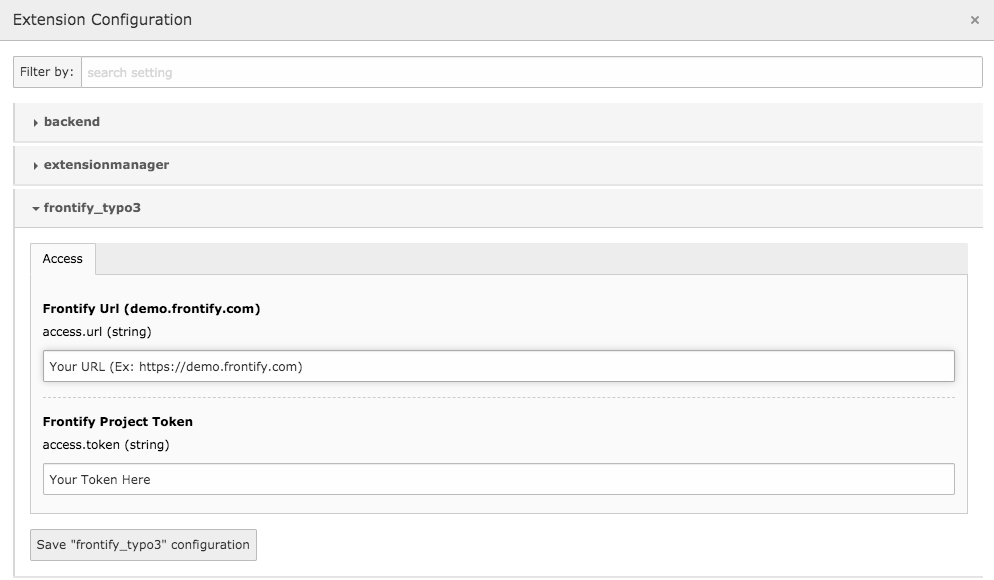
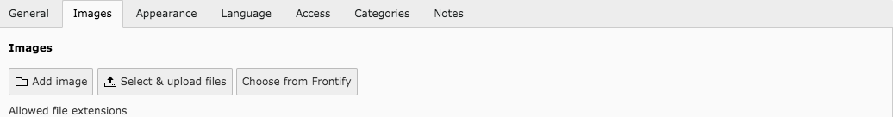
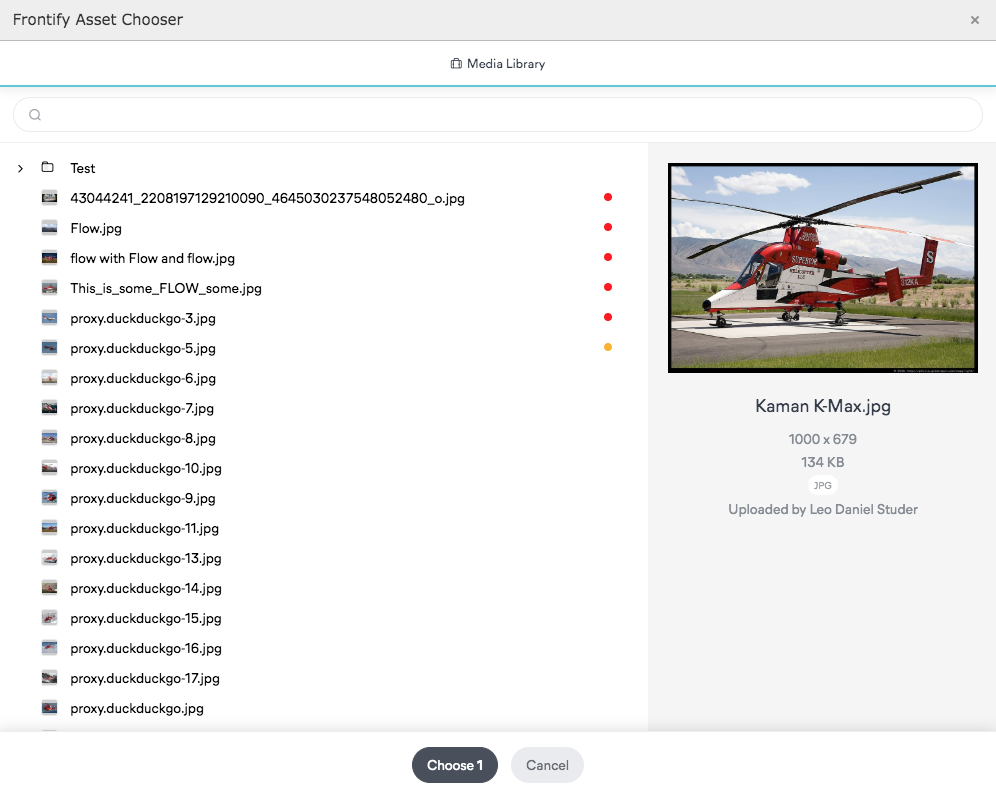

# Frontify Typo3 Integration

Integrate the Frontify Asset Chooser and allow users to select assets directly from your Frontify Media Library.

## Requirements
 * Typo3 version `^9.5` or `^10.2`. 
 * PHP version `>= 7.2.0` 
 * Composer is required for autoloading and installation of the extension.
 
## Installation
Use composer to install the extension: `composer require frontify/typo3`. 

After installing, activate the extension using `typo3 extension:activate frontify_typo3`.

## Configuration

 1. In typo3 backend, open the Extension Configuration (Admin Tools / Settings) and choose `fronitfy_typo3`
 2. Enter your full frontify domain (ex: https://demo.frontify.com)
 3. Enter the access token of the library you wish to connect
 4. Save the configuration.
 

## Usage

You now have access to the configured media library.

By clicking on it, you get access to the Frontify Asset Chooser which allows you to easily select and search assets.

